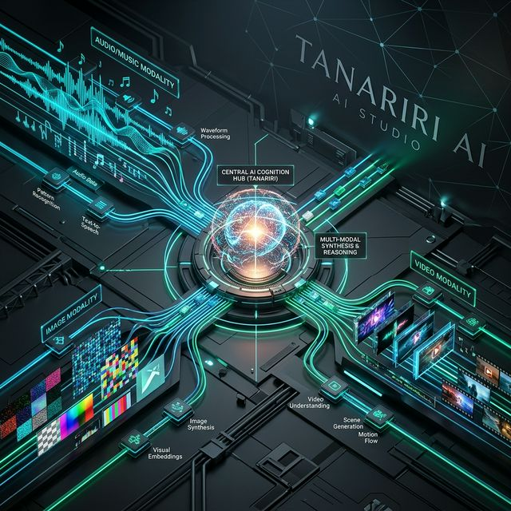
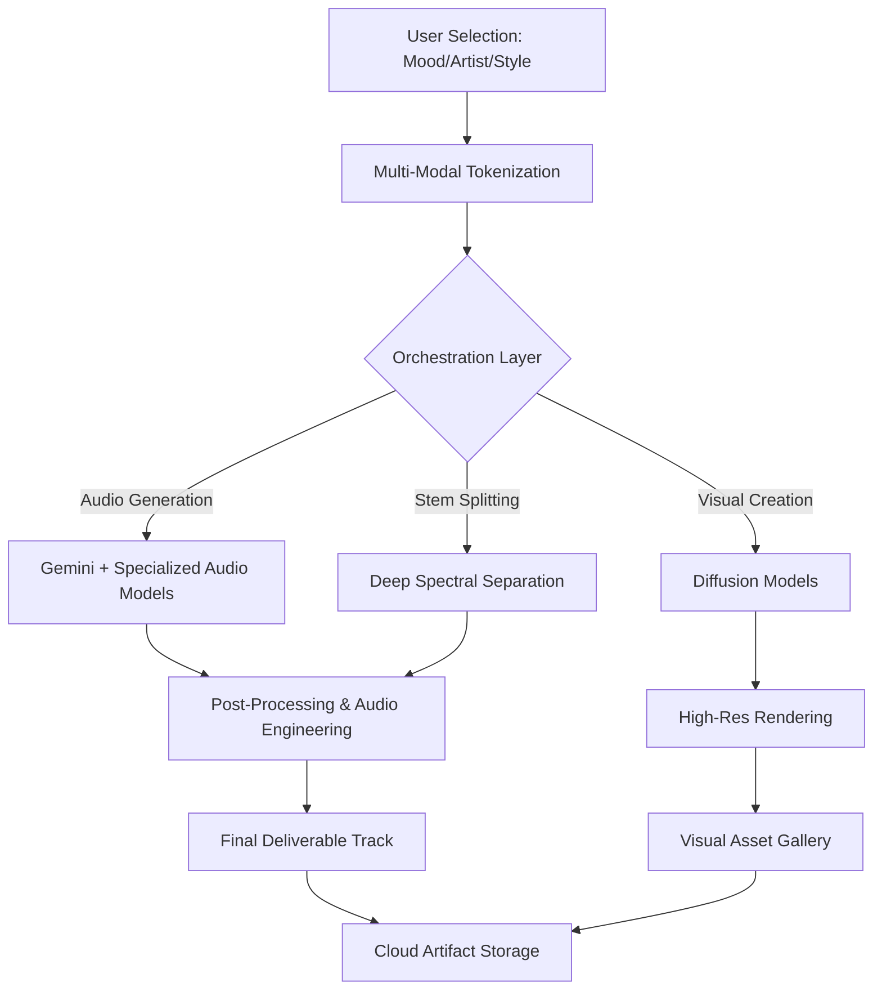

<div align="center">



# 🎵 Tanariri AI Studio 🎵
### *Next-Generation Multi-Modal Generative AI Platform*

[](https://nextjs.org/)
[](https://firebase.google.com/)
[](https://tailwindcss.com/)
[](https://deepmind.google/technologies/gemini/)

</div>

---

## 🌟 Overview

**Tanariri** is a premium, all-in-one generative AI workspace designed for creators, musicians, and digital artists. It integrates advanced audio synthesis, image generation, video production, and intelligent chat assistants into a seamless, high-performance dashboard.

## ⚙️ The Work Algorithm

Tanariri operates on a sophisticated **Multi-Modal AI Pipeline** that ensures high-fidelity output for every creative task.



### 🧠 Core Architecture Components

1.  **Semantic Orchestration**: Translates abstract user moods (e.g., 'Chill', 'Energetic') into precise latent space vectors.
2.  **Generative Audio Engine**: Leverages hybrid models for high-quality music synthesis with customizable instrumentation.
3.  **Real-Time Processing**: Uses edge-optimized inference to provide sub-second preview results.
4.  **State Management**: Fully integrated with Firebase for persistent user sessions and artifact tracking.

---

## 🚀 Features

-   **🎹 AI Music Generator**: Create professional-grade tracks by selecting artists like Kishore Kumar or Sonu Nigam, combined with custom moods/instruments.
-   **✂️ Stem Splitter**: Separate vocals, drums, bass, and piano from any audio track using advanced spectral analysis.
-   **🎨 AI Image Studio**: Generate stunning visual assets with a few simple prompts.
-   **🎬 AI Video Studio**: Bring static images to life or generate motion content from text.
-   **💬 AI Voice & Expert**: High-fidelity text-to-speech and specialized AI assistants for creative brainstorming.

---

## 🛠️ Technology Stack

-   **Frontend**: Next.js 15 (App Router), React 19, TypeScript
-   **Styling**: Tailwind CSS 4, Framer Motion (for smooth micro-animations)
-   **Backend**: Firebase (Cloud Firestore, Auth, Storage)
-   **AI Engines**: Google Gemini API, Generative AI Studio
-   **Icons**: Lucide React

---

## 📦 Getting Started

### Prerequisites

-   [Node.js](https://nodejs.org/) (Latest LTS version recommended)
-   Gemini API Key

### Installation

1.  **Clone the repository:**
    ```bash
    git clone https://github.com/your-repo/tanariri-latest.git
    cd tanariri-latest
    ```

2.  **Install dependencies:**
    ```bash
    npm install
    ```

3.  **Set up Environment Variables:**
    Create a `.env.local` file in the root directory:
    ```env
    NEXT_PUBLIC_GEMINI_API_KEY=your_gemini_api_key_here
    NEXT_PUBLIC_HF_TOKEN=your_huggingface_token_here
    ```

4.  **Run the development server:**
    ```bash
    npm run dev
    ```

5.  **Open the application**: Visit [http://localhost:3000](http://localhost:3000)

---

<div align="center">
  <p>Built with ❤️ by the Tanariri Team</p>
  <p>Exploring the frontiers of Generative Creativity.</p>
</div>
